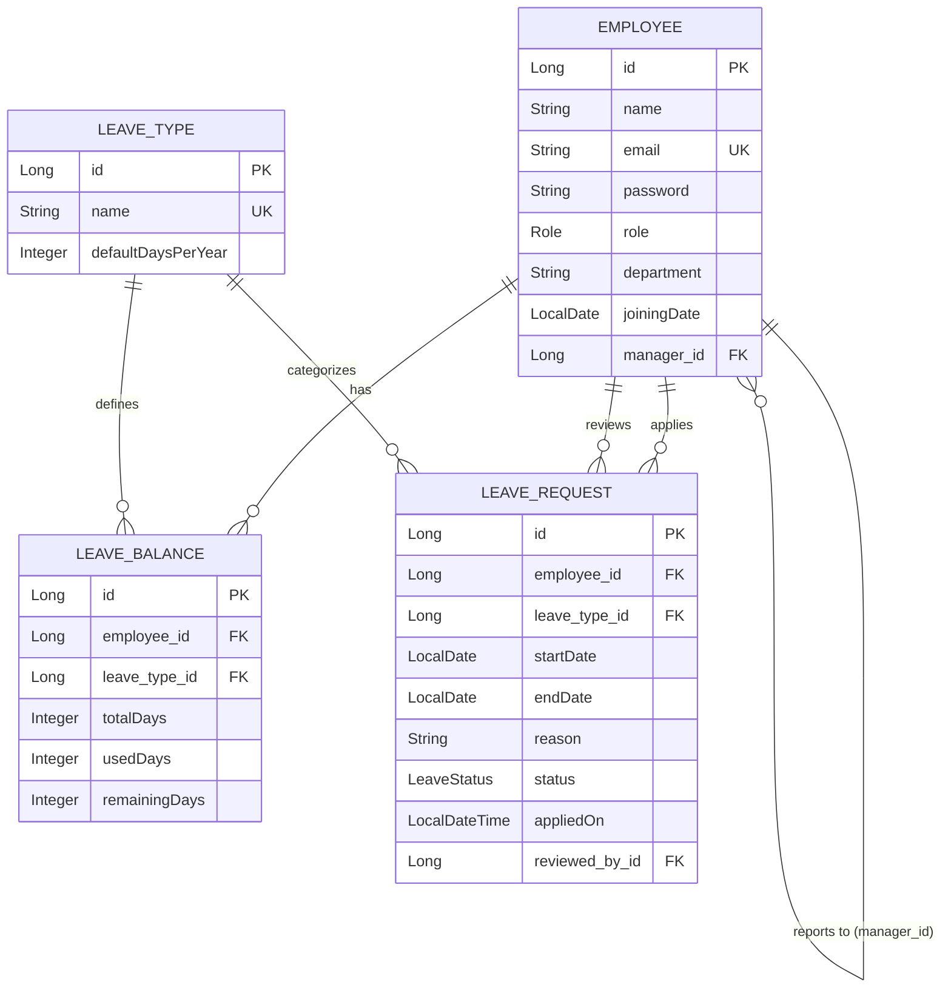

# LeaveTrack — Employee Leave Management System

A robust and secure RESTful Web API for managing employee leave requests, tracking leave balances, and configuring leave types. Built with **Spring Boot 3**, **Spring Security + JWT**, **Spring Data JPA**, and **MySQL**.

---

## 🏗️ Architecture Overview

The application follows a clean, decoupled layer architecture:

```
[ Client (Postman / Swagger) ]
              │
              ▼
    [ REST Controllers ]      <--- DTO Mapping & @Valid Validation
              │
              ▼
    [ Service Layer ]         <--- Core Business Logic & @Transactional
              │
              ▼
 [ Spring Data JPA Repositories ]
              │
              ▼
      [ MySQL Database ]
```

- **Authentication**: Stateless authentication using JSON Web Tokens (JWT). Roles include `EMPLOYEE`, `MANAGER`, and `HR`.
- **Database**: Relational MySQL DB.
- **Background Processes**: Automatic stale request rejection and yearly leave balance reset implemented using Spring Scheduling (`@Scheduled`).

---

## 📊 Entity Relationship (ER) Diagram



---

## 🛠️ Tech Stack
- **Backend Framework**: Java 17, Spring Boot 3.3.0
- **Database**: MySQL, Hibernate / JPA
- **Security**: Spring Security, JWT (JJWT 0.11.5)
- **Utilities**: Lombok, Spring Validation
- **Documentation**: Springdoc OpenAPI / Swagger UI
- **Testing**: JUnit 5, Mockito

---

## 🚀 Setup & Execution Instructions

### Prerequisites
1. **Java 17 Development Kit (JDK)**
2. **MySQL Server** running locally (default port `3306`)

### 1. Database Setup
Create the MySQL database:
```sql
CREATE DATABASE leavetrack_db;
```

### 2. Configure Environment Properties
Database and JWT settings are configured in [application.properties](file:///src/main/resources/application.properties).
If you have a password for your root MySQL user, update it here:
```properties
spring.datasource.username=root
spring.datasource.password=your_mysql_password
```

### 3. Run the Application
You can run the application directly using the Maven wrapper:
```bash
# On Windows
.\mvnw.cmd spring-boot:run

# On Linux/macOS
./mvnw spring-boot:run
```
The server will start on `http://localhost:8080`.

---

## 📝 API Endpoints & Role Access Matrix

| Endpoint | Method | Allowed Roles | Description |
|---|---|---|---|
| `/api/auth/signup` | POST | ALL | Create new employee profile |
| `/api/auth/login` | POST | ALL | Authenticate & retrieve JWT token |
| `/api/leaves/apply` | POST | ALL | Apply for a leave (checks balance/overlaps) |
| `/api/leaves/my` | GET | ALL | Retrieve own leave history |
| `/api/leaves/balance` | GET | ALL | Retrieve own leave balances per leave type |
| `/api/leaves/team` | GET | MANAGER, HR | View pending leave requests from team |
| `/api/leaves/{id}/approve` | PUT | MANAGER, HR | Approve a leave request (deducts balance) |
| `/api/leaves/{id}/reject` | PUT | MANAGER, HR | Reject a leave request |
| `/api/hr/leave-types` | POST | HR | Configure a new leave type (Casual, Sick, etc.) |
| `/api/hr/employees` | GET | HR | List all employee records |
| `/api/hr/reset-balances` | POST | HR | Manually reset company-wide balances |

---

## 📖 Interactive Documentation (Swagger UI)

Interactive Swagger UI is enabled. When the server is running, navigate to:
👉 **[http://localhost:8080/swagger-ui.html](http://localhost:8080/swagger-ui.html)**

---

## 🧪 Running Automated Tests
Run unit tests (service layer, balance validation, overlapping validation, etc.) using:
```bash
.\mvnw.cmd test
```

---

## 📬 Postman Collection
A pre-configured Postman collection is exported in the [postman/](file:///postman/) folder:
📄 **[LeaveTrack.postman_collection.json](file:///postman/LeaveTrack.postman_collection.json)**

### How to use:
1. Import the collection into Postman.
2. Select **HR Signup** or **Manager Signup** and run the request to seed users.
3. Run the **Login** request. The test script automatically saves the returned JWT token to a collection-level environment variable named `token`.
4. All subsequent request authorization headers will automatically use `Bearer {{token}}` to authorize operations.
